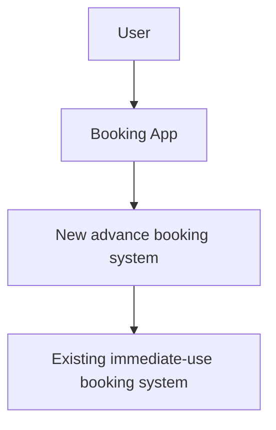
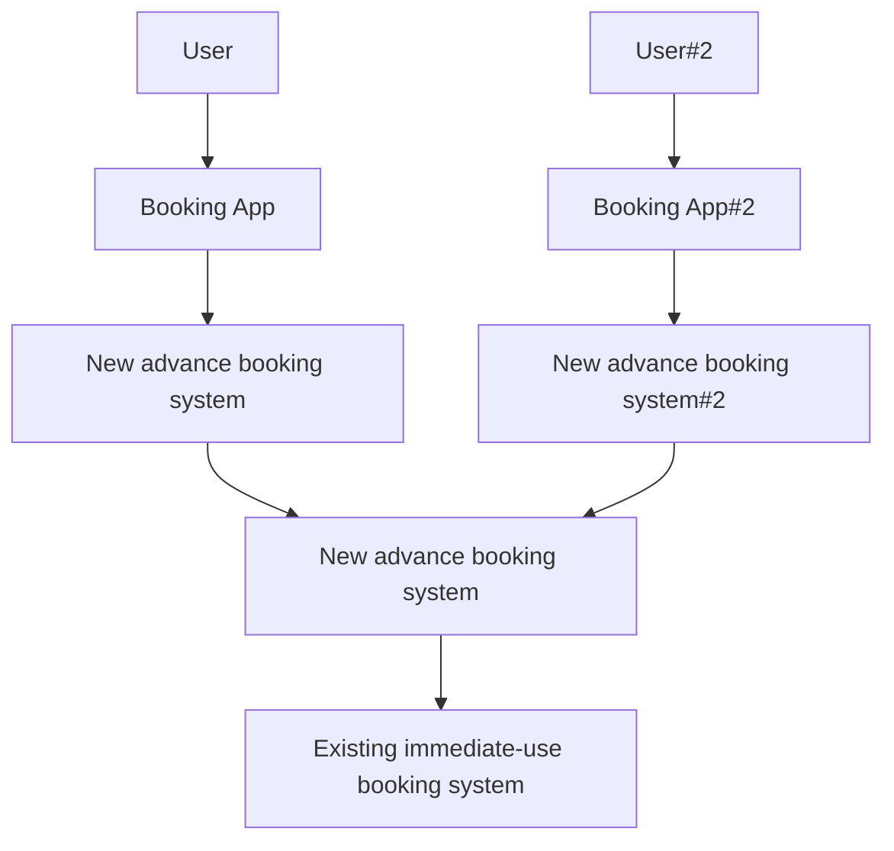

# interval
This package implements bookings with arbitrary durations

Intervals are specified as

```
type Interval struct {
	Start time.Time
	End time.Time
}

```

AVL trees are used to ensure good average look-up performance.

## Features

### Frontend to the existing immediate use booking system

Rather than try to manage all the equipment, this system is simply about assigning users to slots, which are promises of access to kit. Since the kit cannot be accesed through any other gatekeeper, this booking system simply waits for pre-booked slots to start, then obtains a token from the underlying instant use booking system. The system is reliant on the exclusive connection to the underlying system:



In the case where multiple booking systems are sharing that access, then there needs to be an interval booking system in front of the instant access system, to mediate between the two competing booking services.





### Export / Import

Booking in advance requires persisting state. This can be done in two main ways

0. export/import the internal representation
0. export/import the transactions used to develop in the internal state

The internal representation might change, e.g. to support new features. Or, there may be an issue with the state becoming corrupted, or there may be need to be a change in the number of booking slots available. Therefore a transaction based approach is preferred. There is perhaps additional overhead after import, however it provides greater flexibility for the future.

We will use this feature for testing. A couple of additional points:
- we'll need to know whether a booking was taken up, so keeping track of booking take ups may be a useful thing to do in this system.
- in fact, it is essential, because if a user cancels, another user books in their place, then we restart, we need to restore the cancellation so the replacement booking is valid when booking system is reconstituted.
- we might have different needs around the storage of the transaction history, so we need to pass the storage unit to the system. It needs to implement an "add record" function.
- we could do the import with a similar system, that provides a get record function. Perhaps a "withimport" function would help at startup. 


### Cancellation

With JWT token authorisation, and no revocation, meaningful cancellation is not possible (a user might cancel then use their browser history to return to the session, interfering with the next user taking over from them).  However, sessions booked in advance, and not yet taken up, have not had their JWT token released, so can be safely cancelled.

### Identity

Without knowing a user's identity from an authoratitive source, we rely on reasonably co-operative users to respect the operation of the pseudoanonymous UUID we place in their browser cache. If they book on one device and want to use it on another, they can always copy across the link in the actual session (e.g. via messaging, email - the links are long and would not be convenient to hand transcribe). Therefore, there is no need to provide a booking transfer system, because it does not add any particular value, is open to spamming (e.g. randomly trying booking codes).


### Configuration

Systems with advance booking can choose to offer fewer slots than they have equipment for, so as to provide some redundancy. For some experiments, there are no duplicates. There could be quite complicated ways in which booking decisions might need to be made, beyond redundancy e.g. assign any equipment to a person on their first visit, and the same equipment again on any subsequent visit. Therefore, concerns around how to book could usefully be separated from the existing booking service. This way, new policies can be developed and implemented without modifying existing booking systems. This implies a front-end in front of the different booking systems:

```mermaid
graph TD
    U[User] --> A;;	
	A[Booking App] --> B[Booking Proxy] ;;
	B --> C[Allocated/Advance] ;;
	B --> D[Freechoice/Advance] ;;
	B --> E[Freechoice/Instant] ;;
    C --> F[Main #1] ;;
    D --> G[Main #2] ;;
    E --> F ;;
	
	```

The booking app has to know about the different forms of requests it needs to be able to make to each different type of booking system it is interacting with. For each pool that can be booked, the app must know the booking policy that applies. There needs to be a defined way to offer different booking types to users. For example:
Policy could be something like 

### immediate/fixed
current system, immediate bookings only, offer four different length sessions

### immediate/flexible
immediate bookings only, but the length of the booking can be defined with arbitrary granularity from a given minimum booking length, to maximum length. We need to limit minimum booking length to avoid surprises like booking a one-second slot, waiting for any checks, and then being thrown straight back to the UI. different minimum lengths would apply to different users, so that system agents such as checkers could make shorter bookings than would be meaningful for a user. So policies for users must fall within the constraints of the equipment's policy limits. E.g. policy limit on equipment might be three hour bookings, but a certain group of users are given a policy of up to 90minutes bookings only. 


### advance/fixed

Bookings can be made either now, or starting at a later time, within a maximum window, with a fixed set of session lengths on offer. acceptable start times would fall on a repeating pattern, to avoid wastage

## advance/flexible
Bookings can be made either now, or starting at a later time, within a maximum window, with an arbitrary length session (less than a maximum allowed), starting at an arbitrary time. Efficiency of bookings is left to users to arrange, e.g. by sliding the start/end of their bookings up against other bookings.

### Some other policy ....

If there are elements that a user must select, these could be added to the booking form via an automatic field generation approach - describe what needs to be asked, and have the booking system ask it. This would allow new booking policies to be developed without necessarily requiring the booking app to be updated.

The date/time picker would be added with some parameters to control granularity, start times, max time. Also, to show any bookable/non-bookable times.


## Polciy updates on the fly

It would be helpful to be able to extend/retract the booking window without having to do a server restart/booking transaction reload. For example, initial rollout might allow a 24hour booking window. If this seems to be working, the window can be extended to 48hours, then a week etc. If it is retracted, any bookings already made will probably be kept.

Would be helpful to be able to clean out bookings as well - e.g. if we get spammed. This is a prompt to remember rate-limiting.


