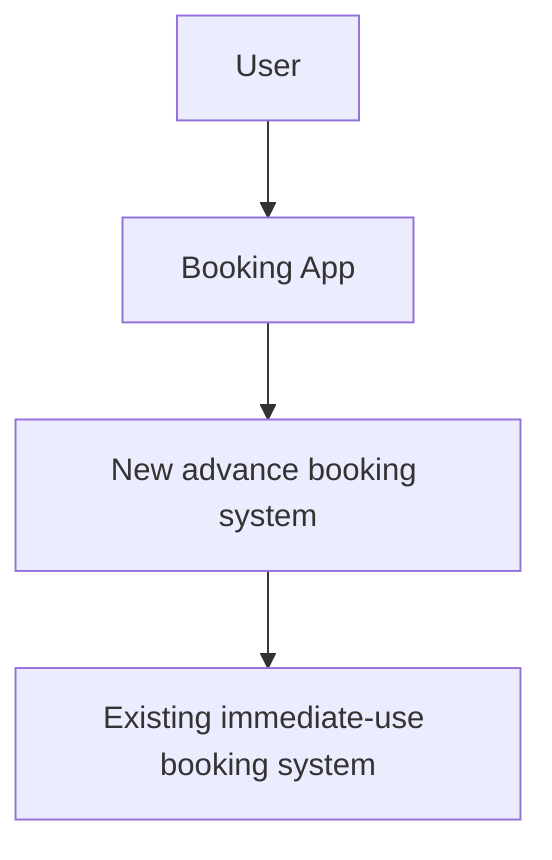
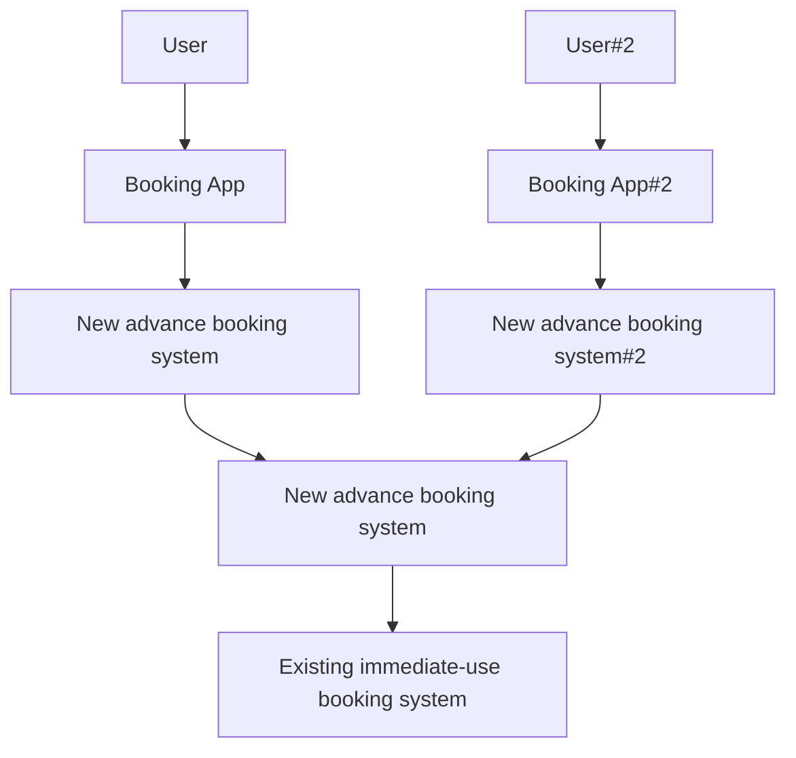

# interval
This package implements bookings with arbitrary durations

## Gotchas

[time](https://pkg.go.dev/time#Time)
"Representations of a Time value saved by the GobEncode, MarshalBinary, MarshalJSON, and MarshalText methods store the Time.Location's offset, but not the location name. They therefore lose information about Daylight Saving Time."

## Introduction

The Store manages policies about when a booking can be made.
The Resource ensures only that it accepts no overlapping bookings.

If we are sharing resources between groups, then we need to have a way of blocking a slot, based on another slot.

This implies some kind of separate specification for each set of users.

These interact - e.g. if we offer exclusive access to one set of users, for short periods, it would be a lot easier to just say for another user - "at any time but when others with a higher priority are using it"


Ok ... so what about an AVL tree that takes intervals with IDs and priority numbers?

OR ... how is a policy different to just booking a kit out???

E.g. set up the kit ... book the slots for a class ...

How to reassign those bookings??? Is there a 


```yaml

filters:
  - id: c3-wk5-wk7
    nbf: 2023-02-01T09:00:00Z
    exp: 2023-04-30T09:00:00Z
	allowed:
	  - nbf: 2023-02-01T09:00:00Z
        exp: 2023-04-30T09:00:00Z
	denied:
	  - nbf: 2023-03-04T14:00:00Z
	    exp: 2023-03-04T15:00:00Z
	  - nbf: 2023-03-05T14:00:00Z
	    exp: 2023-03-05T15:00:00Z 
	  - nbf: 2023-03-06T14:00:00Z
	    exp: 2023-03-06T15:00:00Z
  - id: ed1
    allowed:
	  - nbf: 2023-03-04T14:00:00Z
	    exp: 2023-03-04T15:00:00Z
	  - nbf: 2023-03-05T14:00:00Z
	    exp: 2023-03-05T15:00:00Z 
	  - nbf: 2023-03-06T14:00:00Z
	    exp: 2023-03-06T15:00:00Z	
	
groups:
  controls3:
    slots:
	- id:  spinner-v2-weight-00:
      filters: 
	    - c3-wk5-wk7 
	  
	- id:  spinner-v2-weight-01
	  filters: 
	    - c3-wk5-wk7
		
  engineeringdesign1:
    slots:
	- id: spinner-v2-weight-00
	  filters: 
	    - ed1-wk5-s1
		- ed1-wk5-s2
		- ed1-wk5-s3
	- id: spinner-v2-weight-01
	  filters:
		- ed1-wk5-s1
		- ed1-wk5-s2
		- ed1-wk5-s3

	  


```


Intervals are specified as

```
type Interval struct {
	Start time.Time
	End time.Time
}

```

AVL trees are used to ensure good average look-up performance.

## Features

// it would be helpful if people were warned about non-redundant equipment
// e.g. messaging them when equipment is known to be offline and unavailable for their booking
// or alerting them to a status page.

// Granularity of booking, and display of booking slots.
// we can let the user interface invert bookings information to show availability.
// If we assume "bookable unless booked", then graphically, put the background colour
// to the "free" colour, and overlay bookings in "booked" colour. Save processing it.


### Frontend to the existing immediate use booking system

Rather than try to manage all the equipment, this system is simply about assigning users to slots, which are promises of access to kit. Since the kit cannot be accesed through any other gatekeeper, this booking system simply waits for pre-booked slots to start, then obtains a token from the underlying instant use booking system. The system is reliant on the exclusive connection to the underlying system:



In the case where multiple booking systems are sharing that access, then there needs to be an interval booking system in front of the instant access system, to mediate between the two competing booking services.





### Export / Import

Booking in advance requires persisting state. This can be done in two main ways

0. export/import the internal representation
0. export/import the transactions used to develop in the internal state

The internal representation might change, e.g. to support new features. Or, there may be an issue with the state becoming corrupted, or there may be need to be a change in the number of booking slots available. Therefore a transaction based approach is preferred. There is perhaps additional overhead after import, however it provides greater flexibility for the future.

We will use this feature for testing. A couple of additional points:
- we'll need to know whether a booking was taken up, so keeping track of booking take ups may be a useful thing to do in this system.
- in fact, it is essential, because if a user cancels, another user books in their place, then we restart, we need to restore the cancellation so the replacement booking is valid when booking system is reconstituted.
- we might have different needs around the storage of the transaction history, so we need to pass the storage unit to the system. It needs to implement an "add record" function.
- we could do the import with a similar system, that provides a get record function. Perhaps a "withimport" function would help at startup. 


### Cancellation

With JWT token authorisation, and no revocation, meaningful cancellation is not possible (a user might cancel then use their browser history to return to the session, interfering with the next user taking over from them).  However, sessions booked in advance, and not yet taken up, have not had their JWT token released, so can be safely cancelled.

### Identity

Without knowing a user's identity from an authoratitive source, we rely on reasonably co-operative users to respect the operation of the pseudoanonymous UUID we place in their browser cache. If they book on one device and want to use it on another, they can always copy across the link in the actual session (e.g. via messaging, email - the links are long and would not be convenient to hand transcribe). Therefore, there is no need to provide a booking transfer system, because it does not add any particular value, is open to spamming (e.g. randomly trying booking codes).


### Configuration

Systems with advance booking can choose to offer fewer slots than they have equipment for, so as to provide some redundancy. For some experiments, there are no duplicates. There could be quite complicated ways in which booking decisions might need to be made, beyond redundancy e.g. assign any equipment to a person on their first visit, and the same equipment again on any subsequent visit. Therefore, concerns around how to book could usefully be separated from the existing booking service. This way, new policies can be developed and implemented without modifying existing booking systems. This implies a front-end in front of the different booking systems:

```mermaid
graph TD
    U[User] --> A;;	
	A[Booking App] --> B[Booking Proxy] ;;
	B --> C[Allocated/Advance] ;;
	B --> D[Freechoice/Advance] ;;
	B --> E[Freechoice/Instant] ;;
    C --> F[Main #1] ;;
    D --> G[Main #2] ;;
    E --> F ;;
	
	```

The booking app has to know about the different forms of requests it needs to be able to make to each different type of booking system it is interacting with. For each pool that can be booked, the app must know the booking policy that applies. There needs to be a defined way to offer different booking types to users. For example:
Policy could be something like 

### immediate/fixed
current system, immediate bookings only, offer four different length sessions

### immediate/flexible
immediate bookings only, but the length of the booking can be defined with arbitrary granularity from a given minimum booking length, to maximum length. We need to limit minimum booking length to avoid surprises like booking a one-second slot, waiting for any checks, and then being thrown straight back to the UI. different minimum lengths would apply to different users, so that system agents such as checkers could make shorter bookings than would be meaningful for a user. So policies for users must fall within the constraints of the equipment's policy limits. E.g. policy limit on equipment might be three hour bookings, but a certain group of users are given a policy of up to 90minutes bookings only. 


### advance/fixed

Bookings can be made either now, or starting at a later time, within a maximum window, with a fixed set of session lengths on offer. acceptable start times would fall on a repeating pattern, to avoid wastage

## advance/flexible
Bookings can be made either now, or starting at a later time, within a maximum window, with an arbitrary length session (less than a maximum allowed), starting at an arbitrary time. Efficiency of bookings is left to users to arrange, e.g. by sliding the start/end of their bookings up against other bookings.

### Some other policy ....

If there are elements that a user must select, these could be added to the booking form via an automatic field generation approach - describe what needs to be asked, and have the booking system ask it. This would allow new booking policies to be developed without necessarily requiring the booking app to be updated.

The date/time picker would be added with some parameters to control granularity, start times, max time. Also, to show any bookable/non-bookable times.


## Polciy updates on the fly

It would be helpful to be able to extend/retract the booking window without having to do a server restart/booking transaction reload. For example, initial rollout might allow a 24hour booking window. If this seems to be working, the window can be extended to 48hours, then a week etc. If it is retracted, any bookings already made will probably be kept.

Would be helpful to be able to clean out bookings as well - e.g. if we get spammed. This is a prompt to remember rate-limiting.


# Interval -- README from internal interval package

## Motivation

This implementation of the interval tree data structure is intended to work with arbitrary intervals of time, represented by integers. This retains the generality of the unix epoch approach to representing moments in time, with the resolution of the epoch time being left open to either seconds, milliseconds etc as required by the user of the library. These intervals of time are represented on a one-dimensional interval tree. 

### Limitation to one-dimension
The current implementation is limited to one-dimension because this represents the minimum viable approach required. While there is a second potential dimension to be considered, which is multiple instances of the same fungible item being booked - that is out of scope of the present implementation because iterating over all items of equipment in a list to check whether they are free or not, requires at most only one available item to be returned, and not a simultaneous search for all available kits. The use case for finding all available kits is in visualising the future availability of all kits, but this is probably efficiently solved by querying availability at individual points in time as appropriate to the graph (e.g. at half-hourly points for the next 12 hours). 

### Motivation

Booking systems typically simplify their data structures by enforcing opinions about the allowable booking slots. For example, hotel rooms are booked by the night, and gym classes are booked by the hour. Remote laboratory experiments differ in that assumptions made for one type of experiment, can be vastly different for another. Making a one-size-fits-no-one assumption about what slot size to pick might be an acceptable tradeoff in a small laboratory with relatively homogenous experiments, but soon leads to tensions when the laboratory expands, or encounters suggestions for new use cases not previously anticipated. Let's consider a limited selection of some already-known experiment types to see where the issues lie.

### Example durations for some typical experiments

Experiments can have vastly different run times depending on the nature of the experiment, and the educational task. For example:

- a wobbling beam experiment might require only 15 seconds to run, in a batch job. 
- a pendulum exploration exercise might take 15 minutes
- a truss experiment might need 20 minutes
- a spinning disk experiment might need 90 minutes 

These same experiments may also need maintenance windows, or self-check windows, where they cannot be booked by users. A self check routine can take anywhere from around a few seconds for confirming the video and audio are working, to several minutes if physical elements need to stabilise or there are multiple measurements that need to be checked.

### Previous booking system implementations

Booking systems for remote laboratories have tended to mirror classroom schedules, with bookable hour-long slots starting at the top of the hour. In the case of a laboratory with a self-check task, the booking can be shrunk to 55 minutes, with a 5 minute window for the self checking.

### Issues with fixed schedules

Most of the issues relate to scaling up to multiple locations and multiple types of equipment, and experimental tasking. For example:

- task durations vary depending on the educational use case E.g. open-days might need only short slots to get maximum throughput for an introductory exercise in a limited time, while a later year undergraduate may require long slots for in-depth working. 

- lecture demonstrations often come at the start or the end of the lecture, and conference presentations can happen at any time. So you can't shut the lab down for a self check at a fixed time every hour without causing inconvenience. I've previously had to schedule demonstrations around such self-check windows, but do not think organisers of events, or indeed regular users, would tolerate this once it is a mainstream activity.

- multi-location campuses often ofset lecture times to accommodate students travelling from one campus to another, e.g. University of Edinburugh lecture times shift from starting at the top of the hour, to starting at ten minutes past, depending on lecture location, so as to provide a 20-minute travel window to/from the inner city and other campuses. Therefore, aligning a booking session with a scheduled activity is not possible for this campus.

- batch jobs can run in a few seconds, while interactive sessions can last for hours. A generic booking system may well be needed to accommodate self checks for a batch job experiment that last about the same as a single batch job, even though the users experiments are handled in a queue system which itself books longer slots on the experiment (on the assumption it cannot book the self-check time). The same booking system may be handling bookings of up to several hours, so choosing a fixed granularity that is efficient for the batch job self check, would be inefficient for the longer sessions (self check does not waste time, but booking a several hour slot by accumulating micro-slots of a few seconds each, would potentially require thousands of elements to be put in a list to represent a slot of just an hour or two).

## Proposed solution

Since a generic booking system may be called upon to handle such disparate intervals of time, an efficient way to handle bookings ranging from a few seconds to a few months or even years would be to record simply the start and end of the interval. Such as data-structure is the [interval tree](https://en.wikipedia.org/wiki/Interval_tree). This is typically used for identfiying roads that fall within a viewport on a map, for online navigation displays. Existing go-lang implementations of interval trees do not support features required for this task, such as 

- unique segment identifiers (to link to other information about the segment, e.g. via uuid)
- binary interval state, e.g. available or unavailable (effectively two trees ... there is more to unpack here)

### Existing implementations of interval trees in golang

#### nickjameswebb/intervaltree-go

[This implementation](https://github.com/nickjameswebb/intervaltree-go) is incomplete, stalled in 2018, although it intended to implement the same interface as [this python library](https://pypi.org/project/intervaltree/). Whether that library handles intervals the way we want would need further checking.

#### Augmented tree

[This implementation](https://pkg.go.dev/github.com/golang-collections/go-datastructures@v0.0.0-20150211160725-59788d5eb259/augmentedtree) has no unique segment identifiers, and requires additional features to assist with duplicate range handling.

#### Interval

[This implementation](https://pkg.go.dev/modernc.org/interval) appears to support a range of number lines and open/closed interval boundaries, so long as intervals are in ordered lists. The function list does not appear to show support for operations such as splitting and healing intervals (as required for adding and removing bookings). Much of the code appears to be based around helper functions relating to different variable types, wrapping simple greater-than or less-than comparison checks which can be trivially reimplemented.

#### Rangetree
[This implementation](https://pkg.go.dev/github.com/golang-collections/go-datastructures/rangetree) is primarily intended for representing Cartesion data in n-dimensions, using not a tree but a sparse n-dimensional list. There is support for adding and deleting entries, although splitting intervals does not appear to be supported directly, and may be easier to implement if the underlying data structures are restricted to a single dimension, rather than relying on the abstraction of nodes as this library does.

#### Go Data Structures

[Go Data Structures](https://github.com/psampaz/gods) contains an AVL tree. The value is stored as an interface. Perhaps this can be used to hold an interval in struct?


### Existing implementations in other languages

#### C/C++ implemention of BST insert/delete

[This implementation](https://www.geeksforgeeks.org/interval-tree/) is made for a blog post on augmenting BST/AVL with for adding and removing intervals, and provides a possible way to tackle the problem. This article says it is probably better to use an AVL tree rather than BST tree - although this requires every insert and delete operation to rebalance the tree. See e.g. [this description of rebalancing](https://www.geeksforgeeks.org/avl-tree-set-1-insertion/) by using rotations. Hence a Red-Black tree would be better if many insertions and deletions.

#### Red-Black tree

[This implementation](https://www.geeksforgeeks.org/red-black-tree-set-1-introduction-2/) is an example of a red-black tree.


## AVL trees

The AVL tree offers a better guarantee of lookup time than a BST, because the heights are better balanced. The English translations of the original paper is [here](https://zhjwpku.com/assets/pdf/AED2-10-avl-paper.pdf)

> G. M. Adel'son-Vel'skii and E. M. Landis, "An algorithm for the organization of information," Soviet Mathematics Doklady, 3, 1259-1263, 1962
 
A more accessible description of the algorithm is [here](https://en.wikipedia.org/wiki/AVL_tree).


## Troubleshooting

### internal packages not found in goroot?

Let's say we add a new internal package `bar`:

Go to the new internal module `bar` type
```
go mod init bar
```

Then add to the main go.mod

```
require internal/bar v1.0.0
replace internal/bar => ./internal/bar
```

and run `go mod tidy' to fix `go.sum`

See Vlad Bezden's [Post](https://stackoverflow.com/questions/33351387/how-to-use-internal-packages)
