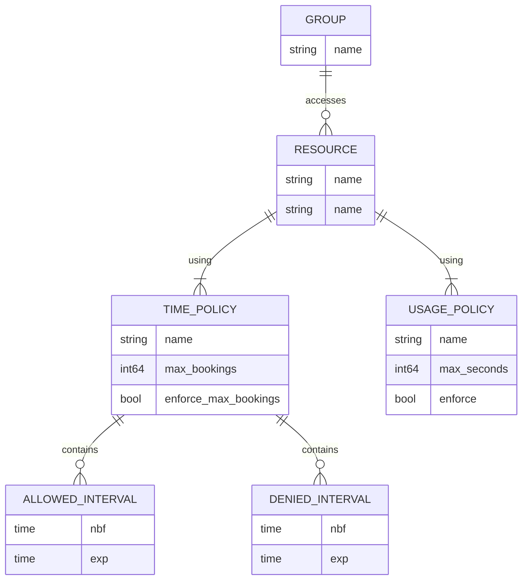
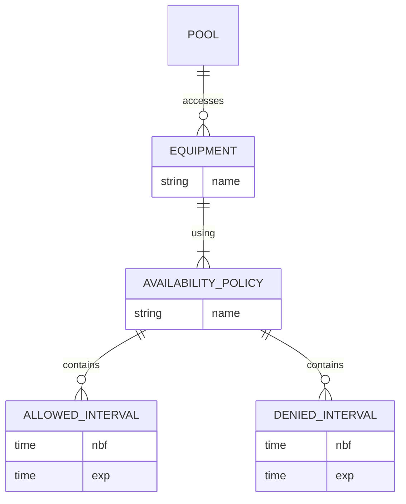

# Store

A store is a collection of resources. Each resource can only be booked once at any given time.

### Time-division multiple access

Some experiments are shared between groups, with several possible policies possible

- Anyone from any group can make a booking
- Groups have orthogonal booking windows( e.g. group A users can only book mornings and group B users can only book afternoons)

The method for implementing these is to assign booking policies to each group.

Policies might be repeated for different resources, so these should be able to be referenced, to ease administration. Note that a reference in YAML just fills in a copy of the object, rather than creating a live dynamic reference .... how to handle in admin system? We could make an explicity reference to policies by name?




```go
type Group struct {
	Name string
	Slots []string
}

type Slot struct {
    Name string
	Resource string
	Policies []string
}
```


### Multiple users sharing resources at the same time
Any sharing of resources is outside the scope of the booking system for efficiency in testing and flexibility in future developments of sharing policies and approaches. This does not prevent sharing, it just pishes responsibility to another layer above the booking system. It makes it clear that access to a resource is "owned" by a single entity at any given time. That entity can then implement whatever sharing policies it wishes, confident that it is in sole charge of access to the resource at that time.


## Actual resources (pools of activities)

A `resource.Resource` is a virtual resource, that references a `pool.Pool`, that contains zero or more `pool.Equipment`.

Should experiment availability be represented as a booking? If it was, there is a chance another booking could take precedence, preventing maintenance etc. If it is a built-in property of the activity itself, then it will always apply and cannot be superseded by 

An actual resource is required to fulfill a booking. If we manage them in the same store, then we can more readily do sanity checks on changes to slots and resources, and avoid some hang-overs from the instant use model (such as only having an expiry time on an activity in a pool, whereas a `filter.Filter` for its availability would be advantageous, e.g. for admin purposes, without having to create an administrative booking to do maintenance, and/or for allowing future changes, without having to be present at the admin terminal to action them).

So .... 

We're only going to assign equipment as it is needed, but it would be good to filter its availability .... and forcing 



